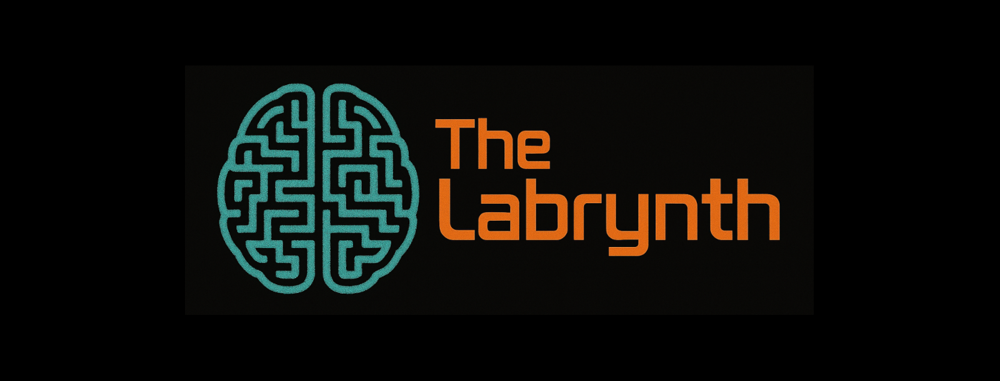

<!--suppress HtmlDeprecatedAttribute -->

    

 

*Written by*: Joshua Boquiren

  

 
 

---

## Overview

**The Labrynth** is an open-source frontend built using the custom Python-based [`REACHER`](https://github.com/Otis-Lab-MUSC/reacher) suite designed to support experimental paradigms involving head-fixed rodents. It supports connections to multiple microcontrollers and facilitates running multiple sessions simultaneously from the same computer or across distributed systems.

---

## **Setup Options**

### **Setup 1: Simple Configuration**

This setup is straightforward and ideal for smaller experiments but can become computationally intensive as the number of sessions increases. 
Please refer to the [Recommended Specs](#recommended-specifications) for system requirements.

**Components:**
- A single computer
- Microcontroller (e.g., Arduino UNO) with compatible firmware installed (download [here](https://github.com/Otis-Lab-MUSC/REACHER-Firmware))
- USB-A to USB-B connector

### **Setup 2: Distributed Configuration**

For experiments involving multiple sessions, this configuration distributes computational tasks, assigning each microcontroller to a dedicated machine. It is highly efficient and scales better than the simple configuration.

**Components:**
- Primary computer
- Secondary machine (e.g., Raspberry Pi) for each microcontroller
- Microcontroller (e.g., Arduino UNO)
- USB-A to USB-B connector

---

## **Suite Components**

### **Dashboard Application**

**The Labrynth** is a browser-based interface built using the `Panel` library. The dashboard enables users to:
- Launch multiple experimental sessions through dynamically added tabs.
- Monitor and control each session independently while maintaining isolation between them.

#### **Features**:
- **Session Management**: Each session tab corresponds to an isolated REACHER instance, ensuring independent data handling.
- **Responsive Interface**: The interface supports dynamic updates, with real-time data displayed using `Plotly` graphs.
- **Extensibility**: Designed to be modular, the dashboard can accommodate additional hardware components and experiment types.

To launch the dashboard, the application uses `BootstrapTemplate` for theming and responsive design.

---

## **Download Options**

You can download the latest version of **The Labrynth** for your operating system below:

| **Operating System**      | **Download Link**                                                                                                                                                    |
|---------------------------|----------------------------------------------------------------------------------------------------------------------------------------------------------------------|
| **Windows**               |    |
| **Linux (Ubuntu/Debian)** |  |
| **macOS**                 |    |

 

## **Recommended Specifications**

| **Component**        | **Minimum Specs**                    | **Recommended Specs**                                       | **High-Performance Specs**                      |
|----------------------|--------------------------------------|-------------------------------------------------------------|-------------------------------------------------|
| **CPU**              | Quad-core processor (e.g., Intel i3) | 6-core or 8-core processor (e.g., Intel i5/i7, AMD Ryzen 5) | 12-core or higher (e.g., AMD Ryzen 9, Intel i9) |
| **RAM**              | 8 GB                                 | 16 GB                                                       | 32 GB or higher                                 |
| **Storage**          | 256 GB SSD                           | 512 GB SSD                                                  | 1 TB NVMe SSD or higher                         |
| **Operating System** | Linux or Windows (64-bit)            | Linux (Ubuntu/Debian preferred), Windows (64-bit), or macOS | Linux (optimized with custom kernels)           |
| **Cooling**          | Basic air cooling                    | Efficient air cooling or entry-level liquid cooling         | High-end liquid cooling                         |
| **GPU (Optional)**   | Integrated graphics                  | Mid-range GPU (e.g., NVIDIA GTX 1660)                       | High-end GPU (e.g., NVIDIA RTX 3080)            |

---

  

  <h2>Copyright & License</h2>
  
© 2025 <a href="http://www.otis-lab.org">Otis Lab</a>. All rights reserved.

  
This project is licensed under the <a href=""><strong>LICENSE</strong></a>.

  
For more information, please contact the author at <a href="mailto:thejoshbq@proton.me"><i>thejoshbq@proton.me</i></a>

